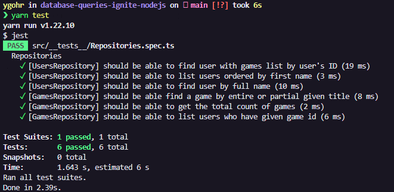

# ⚔️ Ignite - Desafio 6 : Database Queries

<br>

## :pushpin: Sobre o Desafio
Este desafio tem como objetivo realizar consultas no banco de dados com o TypeORM de três maneiras:

- Usando o ORM
- Usando Query Builder
- Usando Raw Query

A aplicação possui dois módulos: `users` e `games`. Um **usuário** pode ter vários jogos e um mesmo **jogo** pode estar associado a vários **usuários**.

O _template_ de arquivos utilizados neste projeto pode ser acessado em: [**template.**](https://github.com/rocketseat-education/ignite-template-database-queries)

## 📋 Requisitos e Regras de Negócio
O documento de referência de Requisitos e Regras de Negócio pode acessado através deste [**link.**](https://www.notion.so/Requisitos-e-Regras-de-Neg-cio-Database-Queries-M-dulo-3-Desafio-1-Ignite-f7a50a1af1fd47ff82bed46c5871eeed)

## 💻 Instalação, Dependências e Executando o Projeto
**1.** Clone este repositório 
```
git clone git@github.com:Ygohr/database-queries-ignite-nodejs.git
``` 
**2.** Vá até o diretório raiz do projeto
```
cd database-queries-ignite-nodejs
``` 
**3.** Instale as dependências necessárias
```
yarn 
ou
npm install
```

## :syringe: Evidência de Testes
Nesta aplicação, são contemplados **Testes Unitários**, visando garantir o correto funcionamento das funcionalidades e manter a aplicação de acordo com os requisitos. 
```
yarn test
```
<br/>



- **Desenvolvido** **por** [**Ygohr**](https://www.linkedin.com/in/ygohr-medeiros-28451b14a/) 🤖